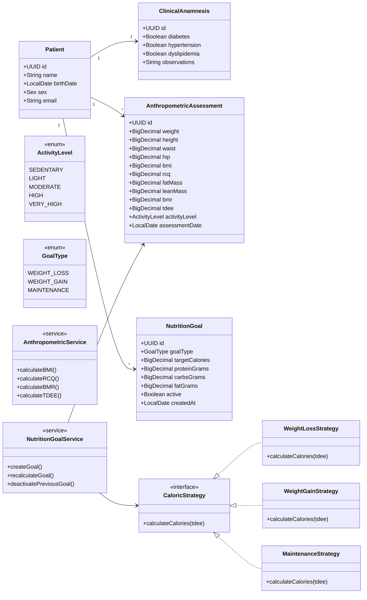

# NutriCore Manager

Sistema de gestão nutricional focado em acompanhamento antropométrico e metas nutricionais personalizadas.

## Modelo de Domínio

Abaixo está o diagrama de classes que representa a estrutura core do sistema:

